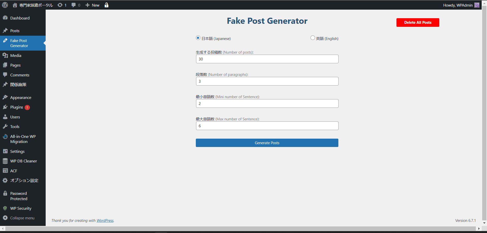

## Screenshot

# Fake Post Generator

A WordPress plugin to generate fake posts with Japanese or English text. This plugin is ideal for developers and site administrators who need sample content for testing, demos, or as placeholders.

## Features

- **Fake Post Generation:** Creates posts with random paragraphs in either Japanese or English.
- **Customizable Settings:** Configure the number of posts, paragraphs per post, and the minimum/maximum word count.
- **Admin Interface:** Simple admin page with form controls for generating or deleting posts.
- **Automatic Activation:** Automatically generates a set number of posts upon plugin activation.
- **Quick Access:** Adds a “Go to Generator” link in the plugin row meta for easy access.
- **Cleanup Option:** Option to delete all generated posts directly from the admin page.

## Installation

1. **Upload Plugin Files:**  
   Copy the plugin folder (e.g., `fake-post-generator`) to your `/wp-content/plugins/` directory.

2. **Activate the Plugin:**  
   Navigate to the WordPress admin dashboard, go to **Plugins**, and activate **Fake Post Generator**.

3. **Access the Generator:**  
   Once activated, a new menu item called **Fake Post Generator** will appear in the admin sidebar. Click it to access the generator interface.

## Usage

### Generating Posts

- **Step 1:** Navigate to the **Fake Post Generator** admin page.
- **Step 2:** Select your desired language (Japanese or English).
- **Step 3:** Set the number of posts, the number of paragraphs per post, and specify the minimum and maximum number of words per paragraph.
- **Step 4:** Click the **Generate Posts** button.  
  Upon successful generation, a success notice will confirm that the posts have been created.

### Deleting Posts

- **Step 1:** On the same admin page, click the **Delete All Posts** button to remove all posts generated by this plugin.

## Code Overview

- **Random Paragraph Generation:**  
  The plugin includes functions to generate random paragraphs using a predefined list of Japanese or English words.

- **Post Generation:**  
  Posts are created using WordPress’s `wp_insert_post()` function with customizable attributes like title, content, author, and categories.

- **Admin Notices and Security:**  
  Nonce verification is implemented for secure form submissions, and a notice is displayed upon successful post generation.

- **Styles and Scripts:**  
  Custom CSS is enqueued to style the plugin’s admin page, ensuring a consistent look within the WordPress dashboard.

## Customization

You can customize the default parameters directly within the code:
- **Number of Posts on Activation:** Modify the values in the `generate_fake_posts_on_activation()` function.
- **Text Content:** Adjust the dummy text in the `generate_random_paragraph()` function for either Japanese or English.
- **Form Defaults:** Change the default values in the form fields within the plugin page.

## Changelog

**Version 1.1**
- Initial release with support for Japanese and English text.
- Added admin interface for generating and deleting posts.
- Integrated plugin row meta link for quick generator access.

## License

This project is licensed under the MIT License. See the [LICENSE](LICENSE) file for details.

## Author

Kyaw Myo Thant

## Support

If you encounter any issues or have suggestions for improvement, please open an issue in the repository or contact the author directly.
